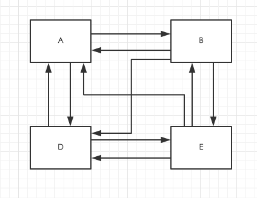
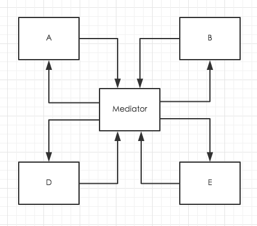

# iOS中介者模式
使用中介者模式（Mediator Pattern）来集中相关对象之间复杂的沟通和控制方式。

> 当不使用中介者时，所有的对象都需要认识其他对象，也就是说，对象之间是紧耦合的。使用终结者后，
对象之间彻底解耦。

> 中介者内包含了整个系统的控制逻辑。当需要一个新的规则时，或者是一个新的对象被加入系统内，其所有
需要的逻辑也都被加进了中介者内。

* 每个对象都会在自己的状态改变时，告诉终结者。
* 每个对象都会对中介者所发出的请求作出回应。

## 中介者的优点
* 通过将对象彼此解耦，可以增加对象的复用性。
* 通过将控制逻辑集中，可以简化系统维护。
* 可以让对象之间所传递的消息变得简单而且大幅减少。

## 中介者的缺点
* 如果中介者设计不当，中介者对象本身会变的过于复杂。
