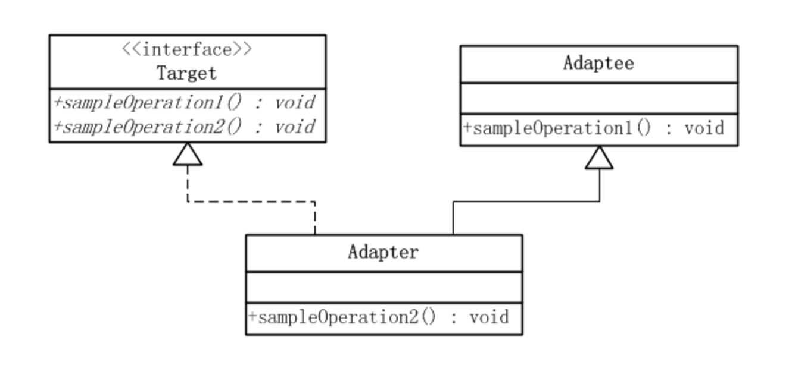
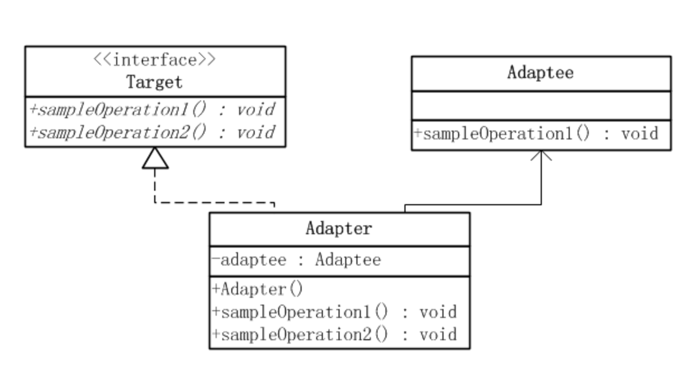

# iOS-objc-Design-Patterns

[适配器模式地址](https://github.com/LeiZong/iOS-objc-Adapter)

[中介者模式地址](https://github.com/LeiZong/iOS-objc-Design-Patterns/blob/master/Mediator/Mediator%20Document/Mediator.md)

[观察者模式地址](https://github.com/LeiZong/iOS-objc-Design-Patterns/blob/master/ObserverPattern/ObserverPattern.md)

## 适配器模式的定义

**适配器模式**把一个类的接口变换成用户所期待的另一种接口，从而使原本因接口不匹配而无法在一起工作的两个类能够在一起工作。

## 使用场景

用电源接口做例子，笔记本电脑的电源一般都是接受5V的电压，但是我们生活中的电线电压一般都是220V的输出。这个时候就出现了不匹配的状况，在软件开发中我们称之为接口不兼容，此时就需要适配器来进行一个接口转换。在软件开发中有一句话正好体现了这点：任何问题都可以加一个中间层来解决。这个层我们可以理解为这里的Adapter层，通过这层来进行一个接口转换就达到了兼容的目的。

## UML类图

**适配器模式**分两种，即**类适配器模式**、**对象适配器模式**

### 类适配器模式
**类适配器模式**把Adaptee的接口转换成为Target需要的接口。

在上图中可以看出，Adaptee类并没有sampleOperation2()方法，而用户则期待这个方法。为使客户端能够使用Adaptee类，提供一个中间环节，即类Adapter，把Adaptee的接口与Target类的接口衔接起来。Adapter与Adaptee是继承关系，这决定了这个是**类适配器模式**：
#### 模式中的角色
* 目标（Target）：客户所期待的接口。

* 适配者（Adaptee）：需要适配的类。

* 适配器（Adapter）：通过包装一个适配者，把原接口转换成目标接口。

### 对象适配器模式
与**类适配器模式**一样，**对象适配器模式**把Adaptee的接口转换成为Target需要的接口，与**类适配器模式**不同的是，**对象适配器模式**不是使用继承实现，而是把Adaptee委派到Adapter中实现的。

#### 模式中的角色
* 目标（Target）：客户所期待的接口。

* 适配者（Adaptee）：需要适配的类。

* 适配器（Adapter）：通过包装一个适配者，把原接口转换成目标接口。

## 类适配器和对象适配器的权衡

* **类适配器**使用对象继承的方式，是静态的定义方式；而**对象适配器**使用对象组合的方式，是动态组合的方式。

* 对于**类适配器**，由于Adapter直接继承了Adaptee，使得Adapter不能和Adaptee的子类一起工作，因为继承是静态的关系，当Adapter继承了Adaptee后，就不可能再去处理Adaptee的子类了。

>对于**对象适配器**，一个Adapter可以把多种不同的Adaptee适配到同一个目标。换言之，同一个Adapter可以把Adaptee和它的子类都适配到目标接口。因为**对象适配器**采用的是对象组合的关系，只要对象类型正确，是不是子类都无所谓。

* 对于**类适配器**，Adapter可以重定义Adaptee的部分行为，相当于子类覆盖父类的部分实现方法。

>对于**对象适配器**，要重定义Adaptee的行为比较困难，这种情况下，需要定义Adaptee的子类来实现重定义，然后让Adapter组合子类。虽然重定义Adaptee的行为比较困难，但是想要增加一些新的行为则方便的很，而且新增加的行为可同时适用于所有的Adaptee。

* 对于**类适配器**，仅仅引入了一个对象，并不需要额外的引用来间接得到Adaptee。

>对于**对象适配器**，需要额外的引用来间接得到Adaptee。

>建议尽量使用**对象适配器**的实现方式，多用合成/聚合、少用继承。当然，具体问题具体分析，根据需要来选用实现方式，最适合的才是最好的。

## 适配器模式的优点
* 更好的复用性

>系统需要使用现有的类，而此类的接口不符合系统的需要。那么通过**适配器模式**就可以让这些功能得到更好的复用。

* 更好的扩展性

>在实现适配器功能的时候，可以调用自己开发的功能，从而自然地扩展系统的功能。

## 适配器模式的缺点
　　过多的使用适配器，会让系统非常零乱，不易整体进行把握。比如，明明看到调用的是A接口，其实内部被适配成了B接口的实现，一个系统如果太多出现这种情况，无异于一场灾难。因此如果不是很有必要，可以不使用适配器，而是直接对系统进行重构。
